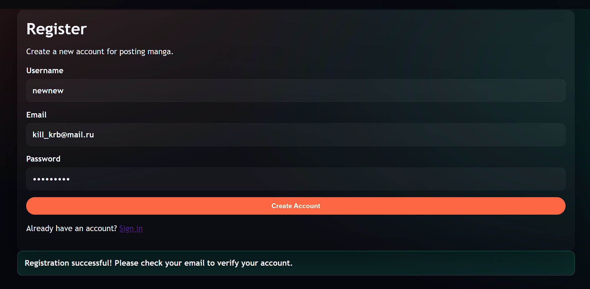
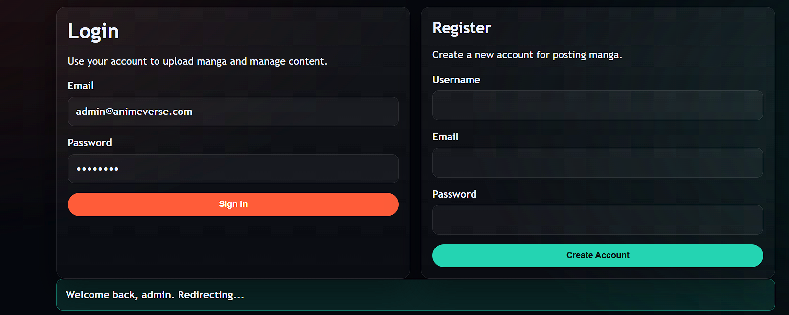
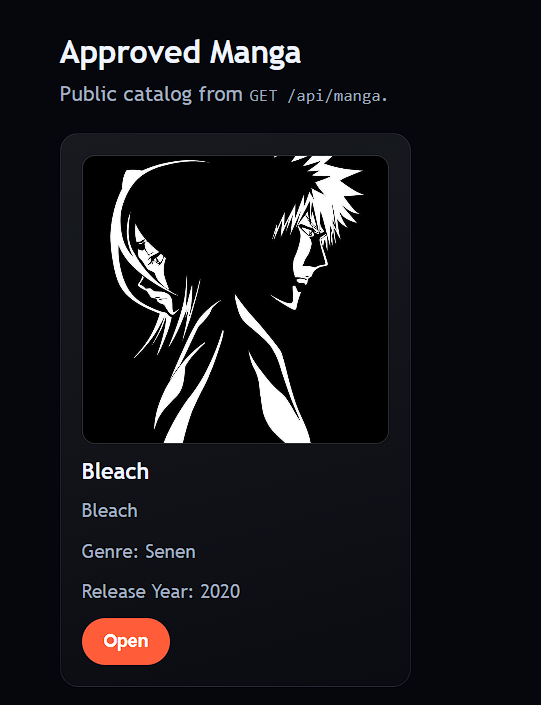
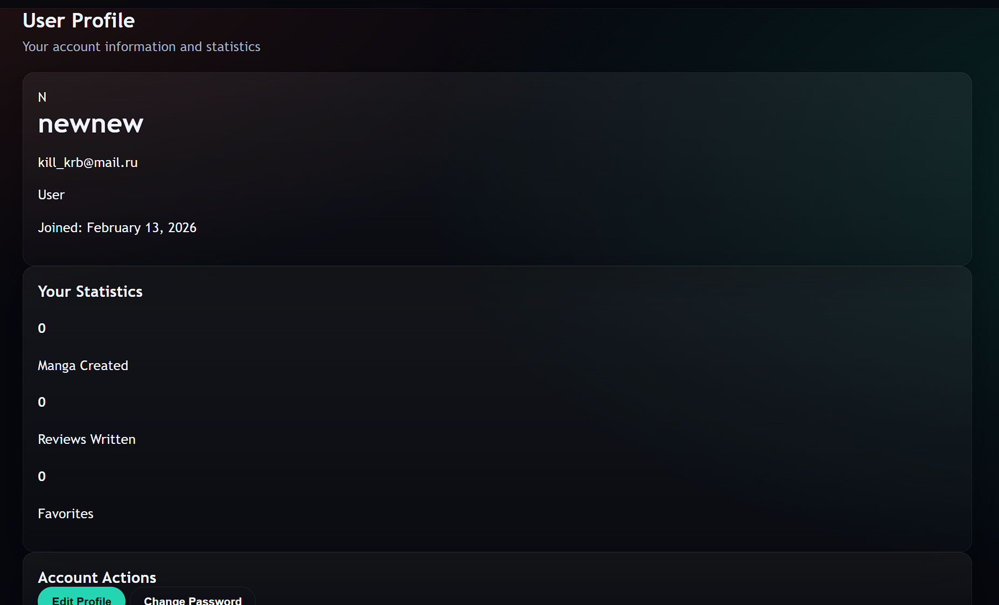
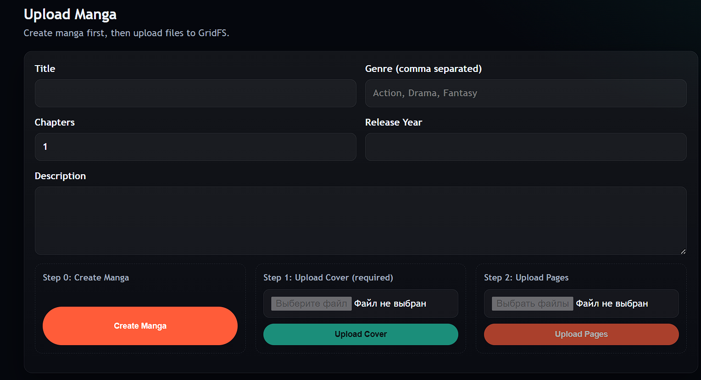

# AnimeVerse - Anime & Manga Fan Website API

## Project Structure

```
animeshki/
├── README.md
├── package.json
├── .gitignore
├── .env
├── server.js
├── config/
│   └── database.js
├── middleware/
│   ├── auth.js
│   └── role.js
├── models/
│   ├── User.js
│   ├── Anime.js
│   ├── Manga.js
│   └── Review.js
├── routes/
│   ├── auth.js
│   ├── users.js
│   ├── anime.js
│   ├── manga.js
│   └── reviews.js
├── controllers/
│   ├── authController.js
│   ├── userController.js
│   ├── animeController.js
│   ├── mangaController.js
│   └── reviewController.js
├── utils/
│   └── validation.js
└── tests/
    └── api.test.js
```

## Team Responsibilities

### Sergey (Backend Developer)
- API development
- Database design
- Authentication implementation
- Route handling
- Controller logic

### Sultan (Database Manager)
- MongoDB schemas and relations
- Data modeling
- Database optimization
- Schema validation

### Mansur (Tester)
- API testing with Postman
- Project documentation
- Test case creation
- Quality assurance

## Project Overview

This is a backend API for an Anime and Manga fan website built using Node.js, Express, and MongoDB. The platform allows users to:

- Register and login with JWT authentication
- Browse anime and manga content
- Leave reviews and ratings
- Manage favorite anime/manga lists
- Admin management of content (add, update, delete)

## Features

- **User Authentication**: JWT-based authentication with role-based access control
- **Content Management**: CRUD operations for anime and manga
- **Review System**: Users can review and rate content
- **Favorites**: Users can save favorite anime/manga
- **Admin Panel**: Special privileges for content management
- **Data Validation**: Comprehensive input validation
- **Error Handling**: Proper error responses and logging

## Screenshots

### Registration Page
<!-- Add screenshot of user registration form -->


### Login Page
<!-- Add screenshot of user login form -->


### Manga List
<!-- Add screenshot of manga listing page -->


### User Profile
<!-- Add screenshot of user profile page with favorites -->


### User Profile


## Technology Stack

- **Backend**: Node.js, Express.js
- **Database**: MongoDB with Mongoose ODM
- **Authentication**: JWT (JSON Web Tokens)
- **Validation**: express-validator
- **Testing**: Jest, Supertest
- **Environment**: dotenv for configuration

## Setup Instructions

1. Install dependencies:
   ```bash
   npm install
   ```

2. Create a `.env` file with your configuration:
   ```
   PORT=3000
   MONGODB_URI=mongodb://localhost:27017/animeverse
   JWT_SECRET=your_jwt_secret_key_here
   JWT_EXPIRE=7d
   NODE_ENV=development
   ```

3. Start the development server:
   ```bash
   npm run dev
   ```

4. For production:
   ```bash
   npm start
   ```

## API Endpoints

### Authentication
- `POST /api/auth/register` - Register new user
- `POST /api/auth/login` - User login

### Users
- `GET /api/users/profile` - Get user profile
- `PUT /api/users/profile` - Update profile
- `GET /api/users/favorites` - Get favorite anime/manga

### Anime
- `GET /api/anime` - Get all anime
- `GET /api/anime/:id` - Get anime by ID
- `POST /api/anime` - Add new anime (admin)
- `PUT /api/anime/:id` - Update anime (admin)
- `DELETE /api/anime/:id` - Delete anime (admin)

### Manga
- `GET /api/manga` - Get all manga
- `GET /api/manga/:id` - Get manga by ID
- `POST /api/manga` - Add new manga (admin)
- `PUT /api/manga/:id` - Update manga (admin)
- `DELETE /api/manga/:id` - Delete manga (admin)

### Reviews
- `POST /api/reviews` - Add review
- `GET /api/reviews/:contentId` - Get reviews for anime/manga

## Development Status

This project structure is complete. The files have been created but the implementation logic will be added in subsequent development phases.
